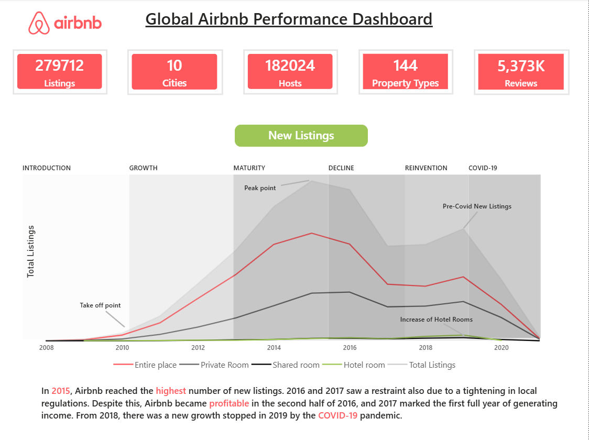
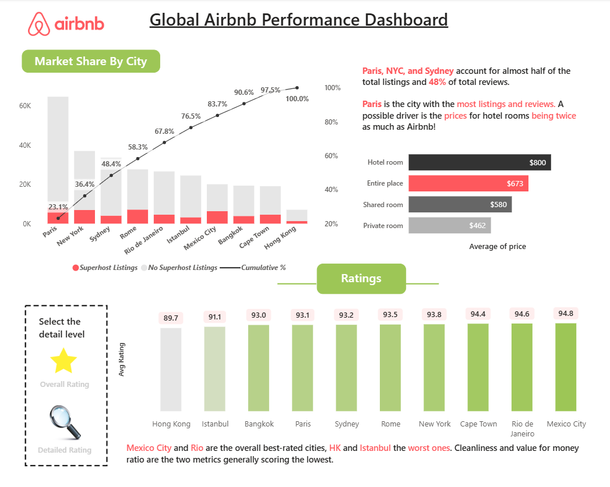
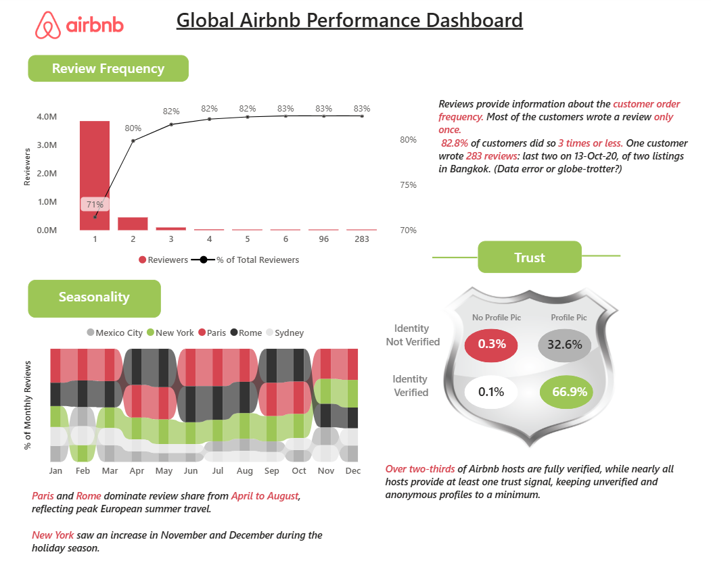

# 📊 Global Airbnb Performance Dashboard

An interactive Power BI dashboard analyzing global Airbnb performance across major cities, uncovering key insights into market trends, pricing dynamics, and listing lifecycle patterns.

---

## 📷 Dashboard Preview



---

## 🧠 Project Overview

This project explores Airbnb data using **two core datasets — Listings and Reviews** — to answer key business questions:

- How has Airbnb grown over time?
- Which cities dominate the market?
- What drives pricing differences across property types?
- How do listings evolve across lifecycle stages?
- Which cities deliver the best customer experience?

The dashboard transforms data into **clear, actionable insights** through visual storytelling.

---

## 📂 Dataset Details

- **Listings Dataset** → Contains information about properties, pricing, location, and listing characteristics  
- **Reviews Dataset** → Contains user reviews, reviewer details, and engagement patterns  

These datasets are combined through data modeling to generate deeper insights.

Due to large file sizes, datasets are hosted externally:

🔗 Listings Dataset: https://drive.google.com/file/d/1yPDHPlRVoKWdDa-WH5nAP0b4YyV5gAwz/view?usp=drive_link 
🔗 Reviews Dataset:  https://drive.google.com/file/d/17MMFMK9jJvTJ9cUg83b20xsIDe0J25Uu/view?usp=drive_link

---

## 📈 Key Insights

- 📌 Peak growth in listings observed around **2015**, followed by stabilization  
- 🌍 **Paris, New York, and Sydney** contribute significantly to total listings and reviews  
- 💰 Hotel rooms are priced higher compared to other property types  
- ⭐ **Mexico City and Rio de Janeiro** show strong overall ratings  
- ⚠️ Cleanliness and value-for-money score comparatively lower  

---

## 🛠️ Tools & Technologies

- Power BI  
- DAX (CALCULATE, FILTER, ALLEXCEPT, etc.)  
- Data Modeling  

---

## 📊 Dashboard Features

- 📉 Listings Lifecycle Analysis (Introduction → Growth → Maturity → Decline → Reinvention)  
- 🌍 Market Share by City with cumulative distribution  
- 💵 Price comparison across property types  
- ⭐ City-wise ratings analysis  
- 🎯 Interactive filters and drill-down  

---

## 📷 Dashboard Details

### 🔹 Market Share & Pricing Insights


### 🔹 Review Frequency & Seasonality Trends


---

## 📁 Project Structure

```
📦 airbnb-dashboard
┣ 📊 Airbnb_Dashboard.pbix
┣ 📷 images/
┣ 📄 README.md
┗ 📄 LICENSE
```
---

## 🎯 Key Learnings

- Building interactive dashboards with storytelling  
- Writing efficient DAX measures  
- Designing user-friendly visual layouts  
- Applying business thinking to data  

---

## 🚀 How to Use

1. Download the `.pbix` file  
2. Open it in Power BI Desktop  
3. Explore the dashboard using filters  

---

## 💡 Future Improvements

- Expand dataset with more cities  
- Add real-time data integration  
- Enhance drill-through analysis  

---

## 🤝 Connect

If you found this project interesting or have feedback, feel free to connect!
